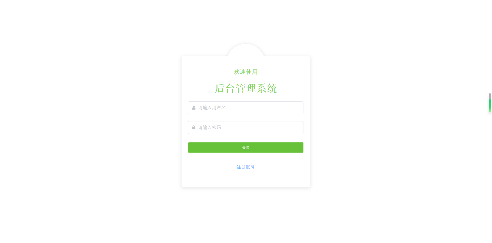
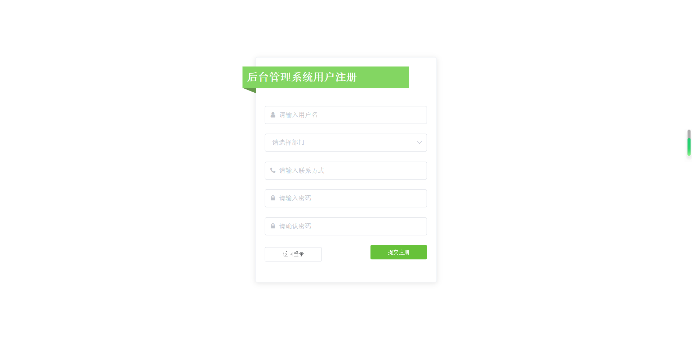
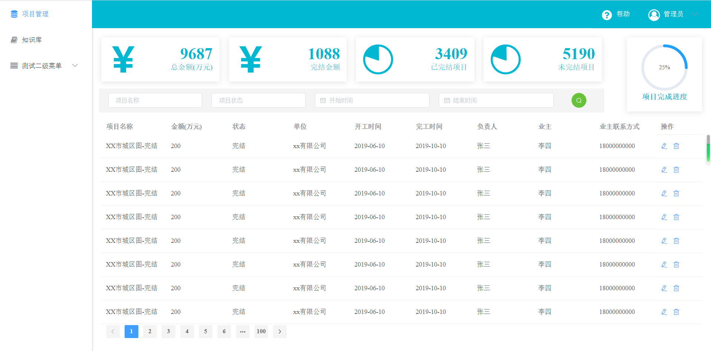

# Vue-ElementUI-Admin
## 基于vue3.0 + Element UI实现后台管理模板
使用vue最新脚手架和Element UI搭建的一个关于后台管理的模板界面，有时间就会更新新的内容，实现一些常用的功能。
## Project setup
```
npm install
```

### Compiles and hot-reloads for development
```
npm run dev
```
### 项目入口src目录
```
│  App.vue
│  main.js
├─api
│      api.js       #配置API URL的地方
│      http.js      #封装axios的一个HTTP请求，
├─assets            #放资源的目录
├─components        #组件目录
│  ├─LeftMenu       #左边菜单组件
│  └─TopMenu        #头部菜单组件
├─router            #路由配置
├─store             #vuex状态管理
└─views             #编写各个页面的目录
    ├─404           #无用的示例页面
    ├─projectManagement   #项目管理页面
    ├─home          #主页面
    ├─login         #登录页面
    ├─register      #注册页面
    ├─repository    #无用的示例页面
    └─test          #无用的示例页面
```
### API配置
``` javaScript
const baseUrl='http://127.0.0.1:8080/serverapi/';
export default {
    projectManagement:{
        list:baseUrl+'projectManagement/list'
    },
    user:{
        list:baseUrl+'user/list'
    }
}
//在页面或者组件里直接使用api
this.api.projectManagement.list
```
### 使用封装好的http请求
``` javaScript
//在页面或者组件里直接使用
this.http.post(this.api.projectManagement.list, {
    name:'test'
}, res => {
    console.log(res);
}, err=>{
    console.log(err);
})
```
### 左边菜单配置
在router.js配置路由即可
``` javaScript
import Vue from 'vue'
import Router from 'vue-router'
import login from '@/views/login/index.vue'
import register from '@/views/register/index.vue'
import home from '@/views/home/index.vue'
import projectManagement from '@/views/projectManagement/index.vue'
import repository from '@/views/repository/index.vue'
import error404 from '@/views/404/index.vue'
import test from '@/views/test/index.vue'

Vue.use(Router)

export default new Router({
  routes: [
    {
      path: "/",
      redirect: '/login',
      hidden: true
    },
    {
      path: '/login',
      component: login,
      name: 'login',
      hidden: true,
      meta: { title: '登录'}
    },
    {
      path: '/register',
      component: register,
      name: 'register',
      hidden: true,
      meta: { title: '注册'}
    },
    {
      path: '*',
      component: error404,
      name: '404',
      hidden: true,
      meta: { title: '404'}
    },
    {
      path: "/home",
      redirect: '/home/projectManagement',
      hidden: true
    },
    {
      path: '/home',
      name: 'home',
      component: home,
      children:[          //这下面配置左边菜单
        {
          path:'projectManagement',
          name:'projectManagement',
          component:projectManagement,
          //这里配置左边菜单标题和图标
          meta: { title: '项目管理', icon: 'fa fa-database' }
        },
        {
          path:'repository',
          name:'repository',
          component:repository,
          meta: { title: '知识库', icon: 'fa fa-book' }
        },
        {
          path:'test',
          name:'测试二级菜单',
          component:test,
          meta: { title: '测试二级菜单', icon: 'fa fa-align-justify' },
          children:[
            {
              path:'test',
              name:'test1',
              component:test,
              meta: { title: 'test1', icon: 'fa fa-align-justify' }
            },
            {
              path:'test2',
              name:'test2',
              component:() => import('@/views/test/index'),
              meta: { title: 'test2', icon: 'fa fa-align-justify' }
            },
            {
              path:'https://www.baidu.com/',
              name:'test2',
              component:test,
              meta: { title: '外链', icon: 'fa fa-align-justify' }
            }
          ]
        }
      ]
    }
  ]
})
```
### 页面展示



